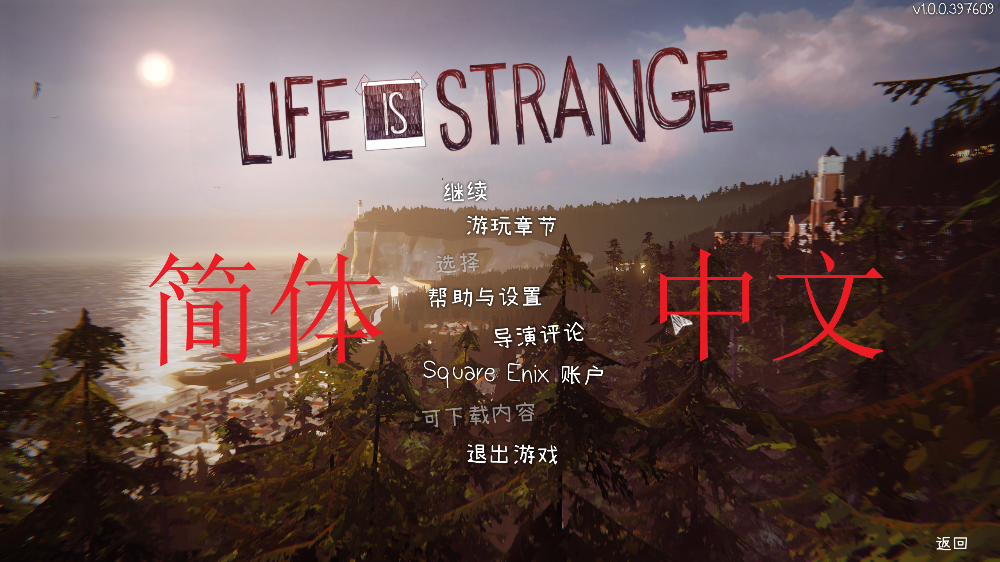
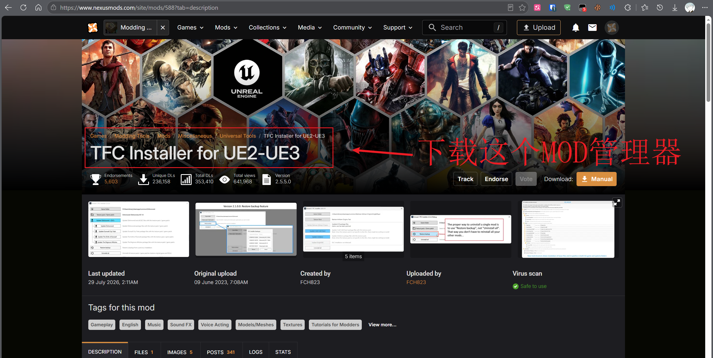
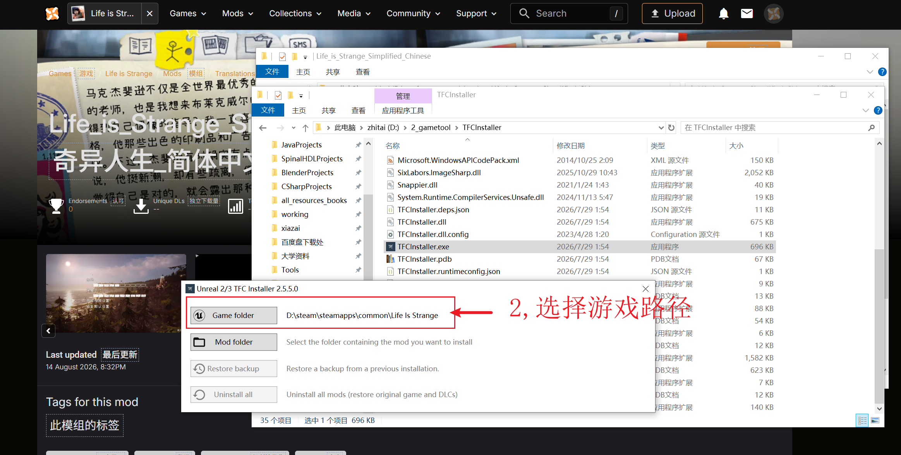
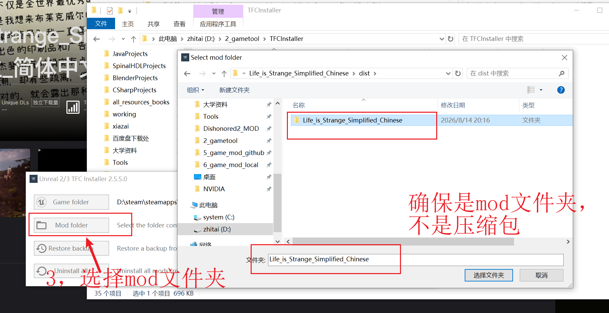
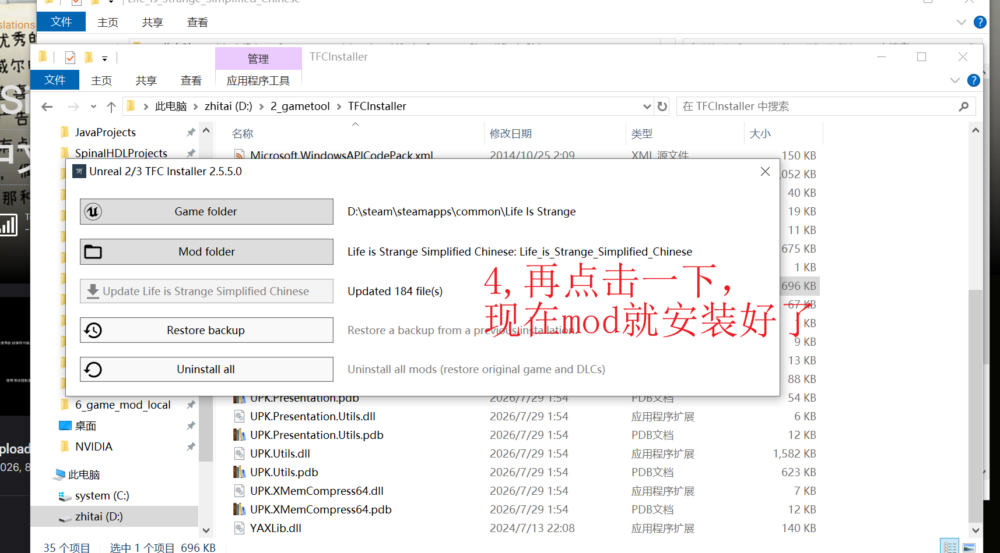
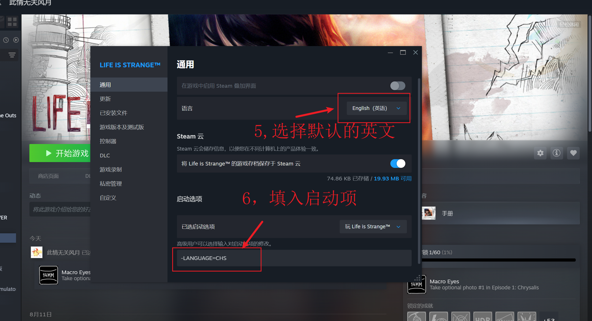

<div align="center">

# Life is Strange Simplified Chinese

### 《奇异人生》简体中文本地化 Mod

**为 Windows Steam 版《Life Is Strange》（2015）提供简体中文菜单、界面、对白字幕与中文字体。**



</div>

## 下载

请前往本仓库的 [Releases](../../releases) 页面下载最新发布包：

```text
Life_is_Strange_Simplified_Chinese.zip
```

请下载 Release 页面单独提供的 Mod ZIP。GitHub 自动生成的
`Source code (zip)` 和 `Source code (tar.gz)` 是项目源代码压缩包，不是可直接安装的 Mod。

## Overview / 简介

本 Mod 面向 2015 年 Windows Steam 版《Life Is Strange》，将游戏中的可见文本本地化为简体中文，
包括主菜单、设置、HUD、互动提示、任务信息、剧情对白、字幕、日记、短信和场景文本。

译文以英文原文为依据，结合人物身份、剧情场景、人物关系、游戏机制和中文玩家的阅读习惯进行处理。
菜单和提示优先保证清晰易懂；对白、日记和短信尽量保留人物语气、情绪与《奇异人生》的叙事氛围。

当前发布包已完成全部五章文本的逐条复核，并统一人物、地点、组织、章节、摄影术语、校园口语、
任务目标和剧情分支中的固定译名。长对白按实际游戏显示空间重新检查分段，菜单、字幕、手写文字
和功能界面也分别使用与原作角色相符的中文字体风格。

片尾夕阳对话、风暴前后、章节前情提要及其它 Bink 过场字幕也已补全；这些字幕使用游戏
`Movies` 目录中的独立脚本，随 Mod 一起安装，不属于普通 UE3 `Localization` 文件。

同时修复了外部 Bink 过场字幕显示空心方框、同一句汉字风格不一致、字号和字重偏差，
以及高分辨率画面中字形边缘不够清晰的问题。全部外部过场脚本现在统一使用小赖字体轮廓，
相关字幕和字体资源会随 Mod 一起安装，正常使用无需额外配置。

本 Mod 使用小赖字体处理对白、手写文字和对话相关字体，使用思源黑体简体处理功能界面字体。
字体资源覆盖本 Mod 所需的简体中文字符，正常情况下不应出现缺字方框。

## Important Notes / 重要说明

1. 当前支持 **Windows Steam 版，游戏可执行文件版本 `1.0.8623.0`**。
2. 安装本 Mod 需要单独下载 [TFC Installer](https://www.nexusmods.com/site/mods/588)。
   TFC Installer 不包含在本 Mod 中，也不属于本项目。
3. TFC Installer 文件夹建议放在游戏目录之外，例如：
   `D:\Tools\TFCInstaller`。
4. 当前版本通过 Steam 启动选项启用简体中文，不需要修改或替换游戏 EXE、DLL，
   也不需要安装任何运行时注入组件。
5. 请在 Steam 游戏属性中把游戏语言设置为 **English（英语）**。
6. Steam 启动选项中填写：

   ```text
   -LANGUAGE=CHS
   ```

7. 如果启动选项中已有其它参数，请在原有内容后空一格添加 `-LANGUAGE=CHS`。
8. 本 Mod 不修改英文语音、游戏流程、角色行为、存档文件或其它官方语言。为防止已有存档在选槽后
   把界面切回英文，安装期间英文文本槽会作为简体中文兼容入口；卸载时由 TFC Installer 恢复原文件。
9. 不要同时安装其它会修改游戏语言文件、对白字幕或中文字体的 Mod。
10. 本 Mod 不包含游戏本体，使用前请先通过合法渠道安装正版游戏。

## Main Features / 主要内容

### 简体中文游戏内容

本 Mod 覆盖游戏过程中玩家会接触到的主要文字内容，从启动界面、设置菜单到剧情推进
和场景探索都保持简体中文显示。不同类型的文本会按照各自的使用场景处理，避免菜单、
任务提示、角色对白和麦克斯的内心独白使用同一种生硬语气。

- 主菜单、暂停菜单、设置和存档界面
- HUD、互动提示、教程和系统提示
- 任务目标、剧情信息和章节标题
- 剧情对白与字幕
- 片尾夕阳对话、风暴前后、章节前情提要及其它 Bink 过场字幕
- 麦克斯的日记、短信、照片和场景文字
- 物品、环境互动和其他可见文本

### 剧情对白与叙事文本

对白会根据说话者的身份、年龄、性格、人物关系和当下情绪调整措辞。麦克斯的旁白、
内心独白、日记和短信会尽量保留她的观察方式与情绪变化；朋友之间的对话、校园
交流和紧张场景则分别保持自然、轻松或压迫的语气。

任务目标、互动提示和系统信息优先保证玩家能够迅速理解当前要做什么、在哪里做以及
操作会产生什么结果。涉及回溯、选择、调查、拍照和场景互动的文字会保留原文中的
条件、范围和提示信息，不用过度简化的表达替代游戏机制。

### 字幕与阅读体验

长对白会按照自然语义和说话节奏进行分段，让中文阅读速度与画面、配音和角色动作
保持协调。字幕不会为了追求短句而随意删减信息，也会尽量避免在人名、数字、按键
提示或完整语义中间断开。

菜单、HUD 和提示文字则使用更紧凑、清晰的表达，以适应游戏原有的界面空间；对白、
日记和短信保留必要的停顿、情绪和叙事细节。

### 术语与显示统一

- 人物、地点、学校、组织、物品和剧情相关名称保持前后一致
- 操作提示、互动按钮和系统状态使用符合 PC 玩家习惯的简体中文
- 英文专有名词、数字、标点和按键标记在需要保留时正常显示
- 对话、手写文字和功能界面分别使用适合其场景的字体风格

### 字体与显示

- 小赖字体：对白、手写文字和对话相关字体
- 思源黑体简体：菜单、HUD、设置等功能界面字体
- 保留英文、数字、标点和按键提示的正常显示
- 适配游戏原有字体大小、字面比例和字幕显示区域
- 提升外部 Bink 过场字幕在高分辨率画面中的边缘清晰度
- 长对白按自然语义分段，减少中文整段同时出现造成的阅读压力

## Package Contents / 文件内容

解压后的 Mod 文件夹第一层应包含：

```text
GameProfile.xml
Game\
licenses\
```

其中：

- `GameProfile.xml`：供 TFC Installer 识别 Mod 的安装配置
- `Game\LifeIsStrangeGame\Localization\CHS\`：简体中文语言资源
- `Game\LifeIsStrangeGame\Localization\INT\`：已有存档语言状态的中文兼容资源
- `Game\LifeIsStrangeGame\Movies\`：片尾、前情提要和其它 Bink 过场的中文字幕脚本
- `Game\LifeIsStrangeGame\CookedPCConsoleFinal\`：中文字体、启动语言资源、运行时字幕字体包和相关资源
- `licenses\`：项目许可及第三方字体许可文件

其中 `CookedPCConsoleFinal` 包含 `Startup_LOC_CHS.upk`、`Startup_LOC_INT.upk`、
运行时字幕字体包 `ExampleGame_LOC_INT.upk` 和 `ExampleGame.upk.PackagePatch`。

请在 TFC Installer 中选择包含 `GameProfile.xml` 的 Mod 根文件夹，
不要选择 ZIP 文件本身，也不要选择其中的 `Game` 子文件夹。

## Recommended Environment / 推荐环境

- 操作系统：Windows
- 游戏版本：Steam 版《Life Is Strange》，可执行文件版本 `1.0.8623.0`
- 前置工具：[TFC Installer](https://www.nexusmods.com/site/mods/588)
- Steam 游戏语言：English（英语）
- 推荐安装前状态：未安装其它中文文本、对白字幕或中文字体 Mod

除 TFC Installer 外，不需要安装其它组件。

## Installation / 安装方法

1. 从本仓库的 [Releases](../../releases) 页面下载
   `Life_is_Strange_Simplified_Chinese.zip`。
2. 将 ZIP 解压到一个长期保留的位置。解压后确认第一层可以看到
   `GameProfile.xml`、`Game` 和 `licenses`。
3. 单独下载并解压 TFC Installer，然后运行 `TFCInstaller.exe`。
4. 点击 **Game folder**，选择游戏根目录，例如：

   ```text
   D:\steam\steamapps\common\Life Is Strange
   ```

   请选择游戏本体的根目录，不要选择 `Game` 文件夹，也不要选择 Mod 文件夹。
5. 点击 **Mod folder**，选择解压后的
   `Life_is_Strange_Simplified_Chinese` 文件夹，即包含 `GameProfile.xml` 的文件夹。
6. 点击显示本项目名称的安装按钮；截图中为
   **Update Life is Strange Simplified Chinese**。等待 TFC Installer 显示文件更新完成。
7. 在 Steam 中右键游戏，打开“属性 → 常规”，把游戏语言设置为 **English（英语）**。
8. 在同一页面的“启动选项”中填写：

   ```text
   -LANGUAGE=CHS
   ```

9. 以后直接从 Steam 启动游戏即可。

安装或卸载 Mod 前请先退出游戏。不要在游戏运行时使用 TFC Installer 修改资源。

### 1. 下载 TFC Installer

打开 [TFC Installer](https://www.nexusmods.com/site/mods/588) 页面，选择 **Manual** 下载，
解压后运行 `TFCInstaller.exe`。TFC Installer 文件夹建议放在游戏目录之外。



### 2. 选择游戏目录

点击 **Game folder**，选择《Life Is Strange》的游戏根目录。Steam 默认安装位置通常类似：

```text
D:\steam\steamapps\common\Life Is Strange
```



### 3. 选择 Mod 文件夹

点击 **Mod folder**，选择解压后的 `Life_is_Strange_Simplified_Chinese` 文件夹。
请选择包含 `GameProfile.xml` 的文件夹，不要选择 ZIP，也不要选择其中的 `Game` 子文件夹。



### 4. 安装 Mod

确认游戏目录与 Mod 文件夹都正确后，点击显示本项目名称的安装按钮。TFC Installer
显示文件更新完成后，Mod 即已安装。



### 5. 设置 Steam 语言与启动选项

在 Steam 中打开“属性 → 常规”，把游戏语言设置为 **English（英语）**，然后在
“启动选项”中填写 `-LANGUAGE=CHS`。以后从 Steam 正常启动游戏即可。



## Updating / 更新方法

1. 退出游戏。
2. 使用 TFC Installer 卸载当前版本的本 Mod，确认原版资源已经恢复。
3. 删除旧的 Mod 文件夹。
4. 下载并解压新的 `Life_is_Strange_Simplified_Chinese.zip`。
5. 使用 TFC Installer 安装新的 Mod 文件夹。
6. 如果新 Mod 文件夹位置发生变化，请检查 Steam 启动选项仍然是：

   ```text
   -LANGUAGE=CHS
   ```

不要把新旧 Mod 文件夹的内容混合使用，也不要在旧 Mod 仍处于安装状态时直接覆盖其资源。

## Uninstallation / 卸载方法

1. 退出游戏。
2. 在 Steam“属性 → 常规 → 启动选项”中删除：

   ```text
   -LANGUAGE=CHS
   ```

3. 打开 TFC Installer，使用卸载或恢复备份功能还原游戏原始资源。
4. 确认游戏已恢复后，再删除解压出来的
   `Life_is_Strange_Simplified_Chinese` Mod 文件夹。

请不要只删除 Mod 文件夹而跳过 TFC Installer 的卸载步骤，否则游戏中已经安装的资源不会自动恢复。

## Compatibility / 兼容性说明

- 支持 Windows Steam 版《Life Is Strange》（2015），游戏可执行文件版本为 `1.0.8623.0`。
- 与其它修改相同语言文件、对白字幕、字体或启动方式的 Mod 可能发生冲突。
- 不建议与其它《奇异人生》汉化包、字体替换包或文本 Mod 叠加安装。
- 英文语音和其它官方语言不在本 Mod 的修改范围内；英文文本槽仅在 Mod 安装期间作为简体中文兼容入口。
- 本 Mod 不修改存档文件；不需要手动编辑或转换已有存档。
- 如果游戏更新后版本发生变化，Mod 可能需要更新后才能继续使用。

## Known Notes / 已知说明

- 当前版本不会在游戏设置中额外增加一个独立的“简体中文”语言菜单项，
  请使用 Steam 启动选项 `-LANGUAGE=CHS` 启用。
- 游戏选择已有存档后，部分界面会重新读取存档关联的语言设置；本 Mod 会在安装期间让英文文本槽
  同步显示简体中文，因此主菜单、存档选择界面和进入游戏后的章节内容都应保持简体中文。
- 英文语音保持原样，字幕和界面文字显示为简体中文。
- 片尾、前情提要和其它 Bink 过场字幕来自 `Game\LifeIsStrangeGame\Movies\` 独立脚本；如果只在这些过场看不到字幕，先确认游戏设置已开启字幕，并检查完整 Mod 文件夹是否安装。
- 不同分辨率、显示比例和 UI 缩放设置可能影响自动换行位置；个别长字幕或开场说明可能在短语中间折行，但不会造成译文缺失。
- 如果同时使用其它字体 Mod，实际显示效果可能与本 Mod 的预期不同。

## Credits / 制作信息

**作者：** NoWindNoMoon / 此情无关风月

**简体中文字形：**

- 小赖字体（Xiaolai）
- 思源黑体简体（Source Han Sans SC）

字体依据 SIL Open Font License 1.1 使用。第三方版权与许可详情请参阅：

- [LICENSE.md](LICENSE.md)
- [THIRD_PARTY_NOTICES.md](THIRD_PARTY_NOTICES.md)
- [SourceHanSansSC-COPYRIGHT.md](SourceHanSansSC-COPYRIGHT.md)
- [SourceHanSansSC-OFL.md](SourceHanSansSC-OFL.md)
- [Xiaolai-COPYRIGHT.md](Xiaolai-COPYRIGHT.md)
- [Xiaolai-OFL.md](Xiaolai-OFL.md)

游戏名称、原始文本、图像、音频和其它游戏资产归其各自权利人所有。
本 Mod 是非官方、非商业的玩家制作项目，与游戏发行商、开发商及相关权利人没有隶属或认可关系。
使用本 Mod 前请确保拥有通过合法渠道取得的游戏副本。

本项目的使用与传播条件见 [LICENSE.md](LICENSE.md)。

## Support / 赞赏支持

如果这个项目对您有所帮助，欢迎自愿赞赏支持。您的每一份支持，都是我继续维护和
完善项目的动力。

<table>
  <tr>
    <td align="center" width="50%">
      <br>
      <strong>支付宝赞赏</strong>
    </td>
    <td align="center" width="50%">
      <br>
      <strong>微信赞赏</strong>
    </td>
  </tr>
</table>

## Troubleshooting / 故障排查

### 安装后仍显示英文

- 确认 TFC Installer 的 **Game folder** 选择的是游戏根目录。
- 确认 **Mod folder** 选择的是包含 `GameProfile.xml` 的 Mod 根文件夹。
- 确认 TFC Installer 已完成安装，而不是只解压了 ZIP。
- 确认 Steam 启动选项中存在：

  ```text
  -LANGUAGE=CHS
  ```

- 退出 Steam 后重新启动 Steam 和游戏。
- 确认没有同时安装其它汉化包或字体 Mod。

### 选择存档后恢复英文

- 退出游戏并重新确认 Mod 已安装完成。
- 确认启动参数没有被 Steam 清空或改写。
- 如果曾经安装过其它语言 Mod，先使用 TFC Installer 恢复原版，再重新安装本 Mod。
- 不要手动修改存档文件。

### 字体显示异常或出现缺字方框

- 确认没有叠加其它中文字体替换包。
- 使用 TFC Installer 恢复原版后重新安装本 Mod。
- 如果只在片尾、前情提要或其它 Bink 过场出现异常，请先卸载旧版 Mod，再完整安装当前发布包，避免旧字幕脚本或字体资源残留。
- 如果只在某个界面出现问题，请记录具体章节、界面名称、分辨率和截图后提交反馈。

### TFC Installer 无法安装或卸载

- 关闭游戏后再运行 TFC Installer。
- 确认选择的是游戏根目录和包含 `GameProfile.xml` 的 Mod 根文件夹。
- 不要手动删除处于安装状态的游戏资源。
- 如果曾安装早期版本或其它 TFC Mod，先恢复原版资源，再重新安装本 Mod。
- 必要时使用 Steam 的“验证游戏文件完整性”恢复游戏原始文件，然后重新安装。

## Feedback / 反馈

发现问题时，请在 [GitHub Issues](../../issues) 提交反馈，并尽量提供：

- 章节、场景或具体界面
- 角色、任务或对白的大致内容
- 当前分辨率和显示设置
- 能清楚说明问题的截图
- 安装方式和 TFC Installer 的提示信息

欢迎反馈以下问题：

- 英文或繁体残留
- 字幕缺失、显示异常或换行不自然
- 字体缺字、错位、大小异常或显示不一致
- 人物、地点、组织、物品等译名不统一
- 译文与剧情语境或人物语气不符
- 安装、更新、卸载或启动异常

感谢每一位使用、测试和反馈问题的玩家。
